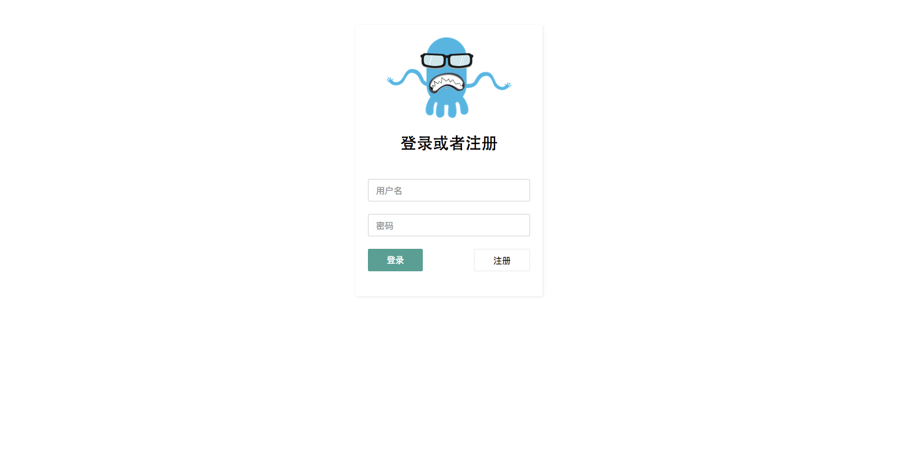

# br0fy

html目录下是客户端，php下面是服务端，一个关于阿里百川的IM群聊demo应用


##usage
* 启动你的php服务

```bash
cd php
composer install
php -S localhost:3001 index.php
```
改变你关于获取阿里百川的数据的appkey secret

* 使用你的app

```bash
cd html
npm install
gulp //默认绑定的3000端口
```

改变app的关于src/constants 的变量的修改，app_key什么的改成自己的，server改成刚刚的php server地址，扩展自来自自己的[startKit](https://github.com/billyct/about-react-redux-start-kit)

之后你当你运行[localhost:3000](http://localhost:3000)的时候可能看到的是下面的场景


那么你就可以试调修改什么的了，或者加点功能进去，现在拥有的功能

* 注册/登录
* 搜索群
* 添加群
* 群聊天 


不过这个百川JSSDK暂时不给力，真话啊 @2015.10.25

当然不能让这段一个熬夜的代码就这样放弃在自己的电脑里

##TODO
* 将api调整掉，应该是放弃这个服务
* 可以考虑写一个socket server或者尝试leancloud什么的
* 将群这个概念整合一下，添加创建群什么的
* 继续做弹幕的话，那么需要一个神奇客户端来做这件事情，最好系统级别
* chrome级别也能接受,要一个canvas的可能会好一点
* 微信公众号也是一个辅助的东西，就是不能在手机里看自己和别人的聊天记录

